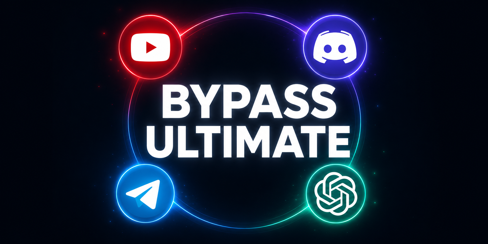

  

<h1 align="center">💬 Discord Fix 2026 — голос, медиа и подключение</h1>

  <b>Чинит RTC Connecting, голосовые каналы и загрузку файлов в Discord.</b> 
  <i>Готовые пресеты Zapret / GoodbyeDPI для клиента Discord в РФ.</i>

  
  
  

---

## Зачем этот репозиторий

**Discord не подключается**, висит **«Проверка голосового соединения»**, не грузятся **картинки** и **эмодзи** — типичные симптомы DPI у провайдера. Эта сборка нацелена на **Discord CDN и голосовые серверы**, а не на общий «интернет-фикс».

---

## Что исправляет

| Симптом | Что даёт сборка |
| :--- | :--- |
| RTC Connecting / нет голоса | Стабильнее вход в голосовые |
| Не грузятся медиа и стикеры | CDN Discord |
| Лаги и обрывы в канале | Меньше разрывов на DPI |
| Клиент «онлайн», но пусто | Обход блокировок маршрута |

---

## 📥 Скачать и запустить

1. Перейдите в **[Releases](./releases/latest)**.
2. Скачайте файл релиза (архив или `.exe`).
3. Установите/распакуйте, запустите **от имени администратора**.
4. **Полностью закройте Discord** (в т.ч. из трея) и откройте снова.
5. Зайдите в голосовой канал для проверки.

---

## Советы

- Не используйте одновременно **VPN** и этот обход — часто конфликтуют.
- Если не помогло — смените сервер голосового региона в настройках Discord.
- Для YouTube лучше отдельный репозиторий `youtube-*` из той же серии.

---

## FAQ

<b>Голос всё равно не работает</b>

Проверьте микрофон в системе, отключите VPN, перезапустите ПК и скрипт от админа.

<b>Работает ли в браузере Discord?</b>

Сборка ориентирована на **десктоп-клиент** Windows. В браузере результат может отличаться.

<b>Антивирус удаляет файл</b>

Добавьте папку в исключения или скачайте повторно только из Releases этого репозитория.

---

<b>Ключевые запросы (SEO)</b>

discord не работает 2026, discord rtc connecting fix, discord voice fix, discord unblock russia, discord cdn fix, zapret discord, goodbyedpi discord, dpi обход discord, discord голосовые не работают

---

  <i>ПО предоставляется «как есть». Ответственность за использование — на пользователе.</i> 
  discord · voice · rtc · dpi bypass · #discord #discordfix #dpi #bypass #voice

<!-- id:0cc7d8797c45 -->
